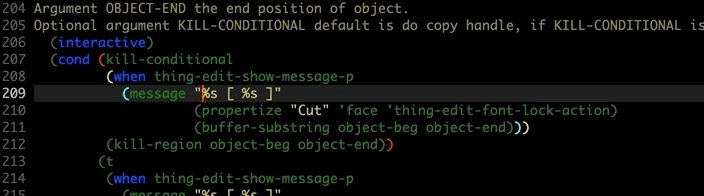

# What is thing-edit ?
This package is some useful functions that base on `thingatpt.el'.
Those function can copy or cut special data object quickly and don't need to move cursor.

## Installation
Clone or download this repository (path of the folder is the `<path-to-thing-edit>` used below).

In your `~/.emacs`, add the following two lines:
```Elisp
(add-to-list 'load-path "<path-to-thing-edit>") ; add thing-edit to your load-path
(require 'thing-edit)
```

## Usage
Bind your favorite key to functions:

| Function                        | Description                                                        |
| :--------                       | :----                                                              |
| thing-cut-sexp                  | cut sexp around cursor.                                            |
| thing-copy-sexp                 | copy sexp around cursor.                                           |
| thing-replace-sexp              | replace sexp around cursor with content of kill-ring.              |
|                                 |                                                                    |
| thing-cut-email                 | cut email string around cursor                                     |
| thing-copy-email                | copy email string around cursor.                                   |
| thing-replace-email             | replace email string around cursor with content of kill-ring.      |
|                                 |                                                                    |
| thing-cut-filename              | cut filename string around cursor.                                 |
| thing-copy-filename             | copy filename string around cursor.                                |
| thing-replace-filename          | replace filename string around cursor with content of kill-ring.   |
|                                 |                                                                    |
| thing-cut-url                   | cut url string around cursor.                                      |
| thing-copy-url                  | copy url string around cursor.                                     |
| thing-replace-url               | replace url string around cursor with content of kill-ring.        |
|                                 |                                                                    |
| thing-cut-word                  | cut word string around cursor.                                     |
| thing-copy-word                 | copy word string around cursor.                                    |
| thing-replace-word              | replace word string around cursor with content of kill-ring.       |
|                                 |                                                                    |
| thing-cut-symbol                | cut symbol string around cursor.                                   |
| thing-copy-symbol               | copy symbol string around cursor.                                  |
| thing-replace-symbol            | replace symbol string around cursor with content of kill-ring.     |
|                                 |                                                                    |
| thing-cut-defun                 | cut function string around cursor.                                 |
| thing-copy-defun                | copy function string around cursor.                                |
| thing-replace-defun             | replace function string around cursor with content of kill-ring.   |
|                                 |                                                                    |
| thing-cut-list                  | cut list string around cursor.                                     |
| thing-copy-list                 | copy list string around cursor.                                    |
| thing-replace-list              | replace list string around cursor with content of kill-ring.       |
|                                 |                                                                    |
| thing-cut-sentence              | cut sentence string around cursor.                                 |
| thing-copy-sentence             | copy sentence string around cursor.                                |
| thing-replace-sentence          | replace sentence string around cursor with content of kill-ring.   |
|                                 |                                                                    |
| thing-cut-whitespace            | cut whitespace string around cursor.                               |
| thing-copy-whitespace           | copy whitespace string around cursor.                              |
| thing-replace-whitespace        | replace whitespace string around cursor with content of kill-ring. |
|                                 |                                                                    |
| thing-cut-page                  | cut page string around cursor.                                     |
| thing-copy-page                 | copy page string around cursor.                                    |
| thing-replace-page              | replace page string around cursor with content of kill-ring.       |
|                                 |                                                                    |
| thing-cut-line                  | cut current line.                                                  |
| thing-copy-line                 | copy current line.                                                 |
| thing-replace-line              | replace current line with content of kill-ring.                    |
|                                 |                                                                    |
| thing-cut-region-or-line        | cut current region or line.                                        |
| thing-copy-region-or-line       | copy current region or line.                                       |
| thing-replace-region-or-line    | replace current region or line with content of kill-ring.          |
|                                 |                                                                    |
| thing-cut-to-line-end           | cut string to end of line.                                         |
| thing-copy-to-line-end          | copy string to end of line.                                        |
| thing-replace-to-line-end       | replace string to end of line with content of kill-ring.           |
|                                 |                                                                    |
| thing-cut-to-line-beginning     | cut string to beginning of line.                                   |
| thing-copy-to-line-beginning    | copy string to beginning of line.                                  |
| thing-replace-to-line-beginning | replace string to beginning of line with content of kill-ring.     |
|                                 |                                                                    |
| thing-cut-comment               | cut comment.                                                       |
| thing-copy-comment              | copy comment.                                                      |
| thing-replace-comment           | replace comment with content of kill-ring.                         |
|                                 |                                                                    |
| thing-cut-paragrap              | cut paragraph around cursor.                                       |
| thing-copy-paragrap             | copy paragraph around cursor.                                      |
| thing-replace-paragrap          | replace paragraph around cursor with content of kill-ring.         |
|                                 |                                                                    |
| thing-cut-parentheses           | cut parentheses around cursor.                                     |
| thing-copy-parentheses          | copy parentheses around cursor.                                    |
| thing-replace-parentheses       | replace parentheses around cursor with content of kill-ring.       |
|                                 |                                                                    |
| thing-cut-number                | cut number around cursor.                                          |
| thing-copy-number               | copy number around cursor.                                         |
| thing-replace-number            | replace number around cursor with content of kill-ring.            |
|                                 |                                                                    |
| thing-cut-whole-buffer          | cut whole buffer                                                   |
| thing-copy-whole-buffer         | copy whole buffer                                                  |
| thing-replace-whole-buffer      | replace whole buffer with content of kill-ring.                    |
|                                 |                                                                    |
